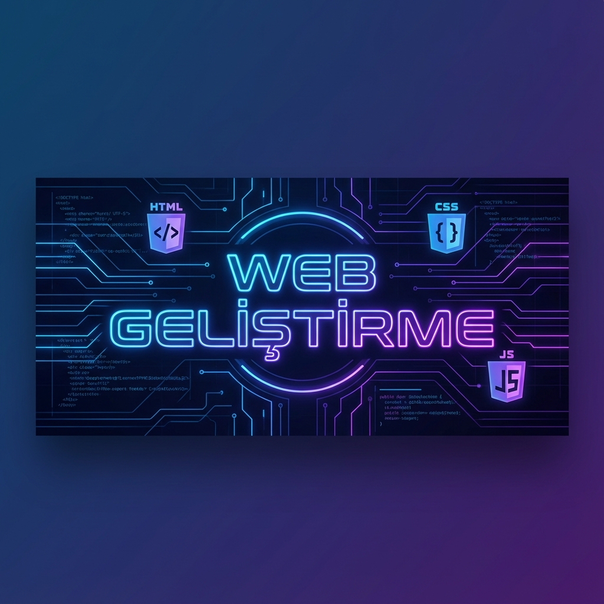

# Web Geliştirme Temelleri



<div align="center">

[](https://developer.mozilla.org/en-US/docs/Web/HTML)
[](https://developer.mozilla.org/en-US/docs/Web/CSS)
[](https://developer.mozilla.org/en-US/docs/Web/JavaScript)
[](LICENSE)

</div>

---

## 🚀 Proje Hakkında

Bu depo, BTK Akademi web geliştirme kursu kapsamında oluşturulan projeleri, notları ve kod örneklerini içermektedir. HTML, CSS ve JavaScript temellerinden başlayarak modern web geliştirme süreçlerine kadar uzanan kapsamlı bir kaynaktır.

## 📂 İçerik

Kurs materyalleri aşağıdaki ana modüllere ayrılmıştır:

| Modül | Açıklama | Süre |
|-------|----------|------|
| **[HTML Kursu](html-course_14hours)** | Web'in yapı taşı olan HTML5 etiketleri, semantik yapı ve formlar. | ~14 Saat |
| **[CSS Temelleri](css-fundamentals-course_10hours)** | Sayfa tasarımı, Flexbox, Grid ve responsive tasarım prensipleri. | ~10 Saat |
| **[JavaScript Temelleri](javascript-fundamentals-course_25hours)** | Programlama mantığı, DOM manipülasyonu, ES6+ özellikleri ve asenkron yapı. | ~25 Saat |

## 🛠️ Kurulum ve Kullanım

Projeleri yerel ortamınızda çalıştırmak için:

1.  Bu depoyu klonlayın:
    ```bash
    git clone https://github.com/bahattinyunuscetin/web-btk-course.git
    ```
2.  İlgili klasöre gidin:
    ```bash
    cd web-btk-course
    ```
3.  İstediğiniz `index.html` dosyasını tarayıcınızda açın.

## 🤝 Katkıda Bulunma

Katkılarınızı bekliyoruz! Lütfen `CONTRIBUTING.md` dosyasını inceleyerek nasıl katkıda bulunabileceğinizi öğrenin.

## 📜 Lisans

Bu proje MIT Lisansı altında lisanslanmıştır. Detaylar için `LICENSE` dosyasına bakabilirsiniz.

---
<div align="center">
  <sub>Mühendislik ve yazılım tutkusuyla ❤️ hazırlanmıştır.</sub>
</div>
